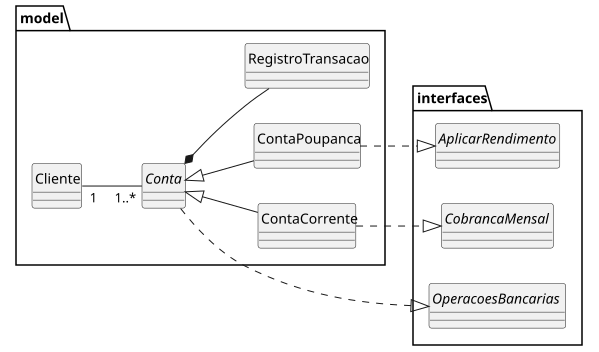
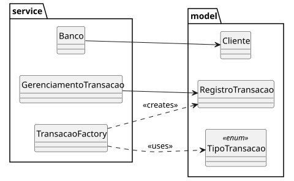

# 💳 Projeto Banco em Java


Sistema bancário orientado a objetos desenvolvido em Java com foco na aplicação prática de conceitos de Programação Orientada a Objetos (POO), estruturas de dados e boas práticas de desenvolvimento.

O projeto evoluiu ao longo do desenvolvimento, incorporando padrões de projeto, segurança, testes automatizados e melhorias de design.

---

##  Objetivo

Este projeto foi desenvolvido com o objetivo de consolidar conhecimentos em:

- Programação Orientada a Objetos (POO)
- Abstração, herança e polimorfismo
- Encapsulamento e regras de negócio
- Estruturas de dados (List, Map, Stack e Queue)
- Stream API (Java 8+)
- Testes unitários com JUnit 5
- Padrões de projeto (Factory Method)
- Segurança com hash de senhas (BCrypt)
- Precisão financeira com BigDecimal
- Boas práticas de organização de código

---

## Funcionalidades

- Abertura e fechamento de contas
- Depósito e saque
- Transferência entre contas
- Conta corrente com limite especial (cheque especial)
- Conta poupança com rendimento automático
- Cobrança de taxa mensal (Conta Corrente)
- Registro completo de transações
- Histórico de operações
- Validação de regras de negócio
- Bloqueio de operações em contas inativas

---

##  Segurança

- Senhas armazenadas utilizando **BCrypt**
- Nenhuma senha é armazenada em texto puro
- Verificação segura através de comparação de hash

---

## ️ Arquitetura e Design

---

##  Diagramas de Classe

Abaixo estão os diagramas de classe do sistema, desenvolvidos utilizando PlantUML no IntelliJ IDEA.

Os diagramas foram criados com o objetivo de representar as principais relações entre as classes do sistema bancário, facilitando a visualização da arquitetura orientada a objetos.

###  Visão Geral do Sistema




---

##  Observações

Os diagramas representam apenas as relações entre as classes, sem detalhamento de atributos e métodos, com foco na estrutura e organização do sistema.


###  Classe Abstrata `Conta`

A classe `Conta` centraliza atributos e comportamentos comuns entre os tipos de conta.

---

###  Factory Method

Foi implementada uma `TransacaoFactory` para criação padronizada de transações:

- Depósito
- Saque
- Transferência

Isso melhora a organização e reduz duplicação de código.

---

###  Estruturas de Dados

O projeto utiliza:

- `List` → histórico de transações
- `Map` → armazenamento de clientes
- `Stack` → navegação de menus (histórico de menus)
- `Queue` → processamento de transações em lote

---

###  Stream API

Utilizada para:

- Filtragem de transações
- Processamento de coleções
- Consultas no histórico de operações

---

##   Testes

- Testes unitários com **JUnit 5**
- Validação de regras de negócio
- Testes para Conta Corrente e Conta Poupança
- Cenários de erro (exceções)

---

## Precisão Financeira

- Uso de `BigDecimal` para cálculos monetários
- Evita erros de arredondamento comuns em `double`

---

##  Estrutura do Projeto

```

src/
└── main/java/com/laryssa/banco
    ├── interfaces/
    │   ├── AplicarRendimento.java
    │   ├── CobrancaMensal.java
    │   └── OperacoesBancarias.java
    │
    ├── model/
    │   ├── Cliente.java
    │   ├── Conta.java
    │   ├── ContaCorrente.java
    │   ├── ContaPoupanca.java
    │   ├── Main.java
    │   ├── RegistroTransacao.java
    │   │
    │   └── enums/
    │       ├── StatusTransacao.java
    │       └── TipoTransacao.java
    │
    ├── service/
    │   ├── Banco.java
    │   ├── GerenciamentoTransacao.java
    │   └── TransacaoFactory.java
    │
    └── util/
        ├── MenuNavegacao.java
        └── PasswordService.java

````

---

##  Como Executar

### ▶Rodar aplicação

```bash
mvn compile
mvn exec:java -Dexec.mainClass="com.laryssa.banco.model.Main"
````

---

###  Rodar testes

```bash
mvn test
```

---

## 📈 Melhorias Futuras

* [ ] Integração com banco de dados (MySQL/PostgreSQL)
* [ ] API REST com Spring Boot
* [ ] Interface gráfica (Web ou Desktop)
* [ ] Autenticação com sessão/token (JWT)
* [ ] Paginação e filtros avançados no histórico de transações

---

## 👩‍💻 Autora

**Laryssa Martins da Silva**
Estudante de Engenharia de Software


